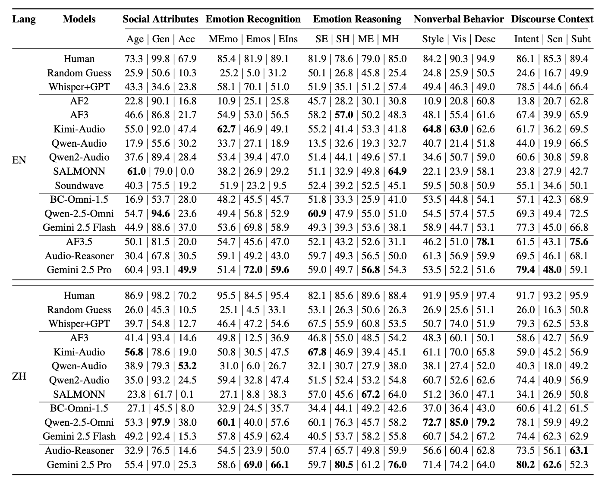
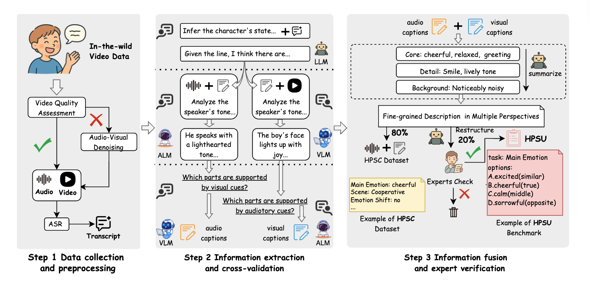

# HPSU: A Benchmark for Human-Level Perception in Real-World Spoken Speech Understanding

[](https://arxiv.org/abs/2511.23178) [](https://huggingface.co/)

## 📖 Overview

**HPSU** (Human-level Perception in Spoken Speech Understanding) is a large-scale benchmark designed to evaluate the perceptual and cognitive capabilities of Speech Large Language Models (Speech LLMs) in real-world scenarios.

- **Scale & Diversity:** Comprises over **20,000 samples** in both **English and Chinese**.
- **Complex Tasks:** Covers 16 distinct tasks ranging from basic attribute recognition to complex inference of subtext and emotional dynamics.
- **Adversarial Robustness:** Explicitly evaluates model resilience against misleading prompts (Standard, Positive, and Negative induction) to test decision-making stability.

An example:


In addition to the benchmark, we release **HPSC (Human-level Perception Spoken Speech Caption)**, a high-quality dataset of 50,000 speech-description pairs to facilitate the training of stronger Speech LLMs.

## 📊 Main Results

We evaluated a total of 13 open-source and proprietary audio models (e.g., Qwen2.5-Omni and Gemini 2.5 Pro); the native GPT-4o audio model was excluded because it refused to answer a large portion of our queries. For comparison, we adopted three baselines: a Human upper bound derived from large-scale native-speaker annotations, a Random Guess chance-level baseline, and a Whisper+GPT cascade that feeds Whisper transcriptions into GPT-4o to isolate the performance gains attributable to acoustic modeling.



## 🧠 Method: Construction Pipeline

The construction of HPSU involves a three-stage semi-automatic pipeline:

1. **Data Collection:** Sourced from diverse video corpora (CelebV-HQ, MELD, etc.) and preprocessed with speech enhancement tools.

2. **Information Extraction:** Utilizes LLMs and Audio/Visual models to extract multi-perspective descriptions.

3. **Fusion & Verification:** Synthesizes information into triplets and undergoes strict human verification.



## 🚀 Getting Started

The metadata for the benchmark is available in [HPSU_data.json](HPSU_data.json). We provide the assessment logic in [evaluate.py](evaluate.py). To run the evaluation, please prepare a result file that mirrors the structure of HPSU_data.json but includes a `prediction` field for each entry. A reference example is provided in [HPSU_data_prediction_demo.json](HPSU_data_prediction_demo.json). Note: For Description and Subtext tasks, an additional selected_field is required in the output (valid values are restricted to `right` or `distractor`).

Run the script using the following command. Ensure you provide the path to your prediction file via ``--input_json``.
```bash
python evaluate.py \
    --api_key "YOUR_API_KEY" \
    --base_url "YOUR_BASE_URL" \
    --model "Your_Evaluator" \
    --input_json "Your_Prediction_File.json" \
```
##### Arguments:
- ``--api_key``: The API key for the judge model (evaluator).
- ``--base_url``: The API endpoint URL for the judge model.
- ``--model``: The identifier for the automated judge/evaluator used to score the predictions.
- ``--input_json``: Path to the file containing your model's predictions.

## 📝 Citation
If you find HPSU or HPSC useful for your research, please cite our paper:
```Code snippet
@misc{li2025hpsubenchmarkhumanlevelperception,
      title={HPSU: A Benchmark for Human-Level Perception in Real-World Spoken Speech Understanding}, 
      author={Chen Li and Peiji Yang and Yicheng Zhong and Jianxing Yu and Zhisheng Wang and Zihao Gou and Wenqing Chen and Jian Yin},
      year={2025},
      eprint={2511.23178},
      archivePrefix={arXiv},
      primaryClass={cs.SD},
      url={https://arxiv.org/abs/2511.23178}, 
}
```

## 📮 Contact
For any questions, please contact:
- Chen Li: lich528@mail2.sysu.edu.cn
- Peiji Yang: peijiyang@tencent.com
- Jianxing Yu: yujx26@mail.sysu.edu.cn

Disclaimer: This dataset contains real-world spoken data. While we have filtered for quality, users should be aware of potential biases inherent in web-sourced data.